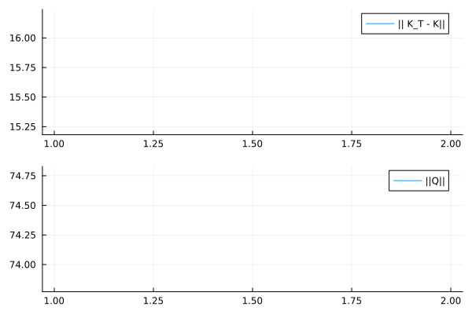

# [Julia] Inverse Reinforcement Learning for Expert-Learner Discrete-time System

## Introduction
Here is my implementation of the model described in the paper **Inverse Reinforcement Q-Learning Through Expert Imitation for Discrete-Time Systems** [paper](https://ieeexplore.ieee.org/document/9537731).

## Experiments:
The algorithm makes the Learner achieve the same control matrix as the Expert, while The state-reward weight converges to a different value than the Expert.

The Expert's control matrix is ​​as follows 
```math
K_{Expert} =    \begin{bmatrix}
 -0.1688 & -0.2009 & 0.1285
    \end{bmatrix}

```

I show the results obtained from my experiments.
```math
Q =    \begin{bmatrix}
 4.62943 &  4.68051 &  1.2945 \\
 4.68051 & -1.14605  & 1.06186 \\
 1.2945  &  1.06186 & -1.63109
    \end{bmatrix}
,
K_{Learner} =    \begin{bmatrix}
 -0.172843 & -0.204428 & 0.125967
    \end{bmatrix}

```

## Results
| Convergence of the proposed algorithm        |
| ------------- |
|       | 

| Output result       |
| ------------- |
|       | 
